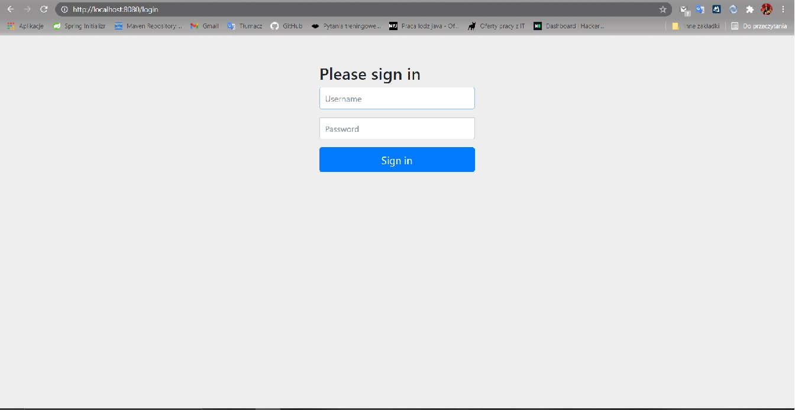
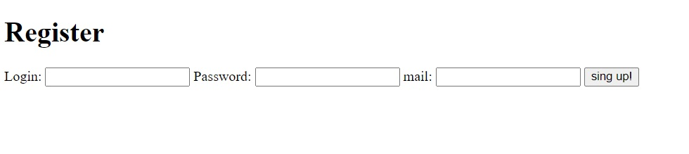
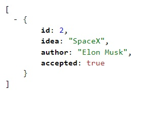

# SUBMIT IDEA	
> If you have an idea for an application but you don't know how to write it. SUBMIT AN IDEA. If you have no idea and can write, take a look and you will find something for yourself.
## Table of Contents
* [General Info](#general-information)
* [Technologies Used](#technologies-used)
* [Features](#features)
* [Screenshots](#screenshots)
* [Setup](#setup)
* [Project Status](#project-status)
* [Contact](#contact)

## General Information
Api for collecting ideas for Api. User login with email authentication.
Access to endpoints depending on the role [User / Mod / Admin](#features).

Test users:

(1) login: Janusz	
	password: Janusz123
	Role: ROLE_ADMIN
	Enabled: true
	
(2) login: Mirek
	password: Mirek123
	Role: RELE_MOD
	Enabled: true

(3) login: Bogdan 
    password: Bogdan123
	Role: ROLE_USER
	Enabled: true
	
(4) login: Krzysiek
	password: Krzysiek123
	Role: ROLE_USER
	Enabled: false
	
After logging in and authenticating via email, you can read others' ideas (JSON) or add yours.

## Technologies Used
- Spring Boot
- Tomcat
- Rest Api
- xml
- swagger
- liquibase
- thymeleaf
- mysql
- 2FA

## Features
Application users are divided into:
1) User unconfirmed 
   
    A user who has provided his data but has not yet confirmed it by e-mail
            
        -register ("/sing-up")
2) User confirmed

    User who can:

        -login ("/login")
        -add an entry ("/addIdeas")
        -view accepted entries ("/getAcceptedIdeas")
3) Mod
user 
        
        confirmed +
        -show unaccepted entries ("/getUnacceptedIdeas")
        -delete entries ("/deleteIdeaById")
        -accepted entries ("/acceptedIdeas")
   
4) Admin

        mod +
        -delate users ("/deleteUser")
        -see all users ("/all")
        -change User to Mod ("/changeRoleToMod")

## Screenshots

## Setup
Clone the project to your own ide. You'll also need a database. 
In AMPPS (or similar) Create the "submitideas" database. 
Liquibase will create a table and the program will fill them with sample users and ideas. 
Run it and navigate to http: // localhost: 8080 / login

## Project Status
Project is: to be completed 

TODO: 
Front. Displaying ideas not with JSON, eg React

## Contact

Created by [_qubiak_]( http://www.linkedin.com/in/bartłomiej-kubiak) - feel free to contact me!

